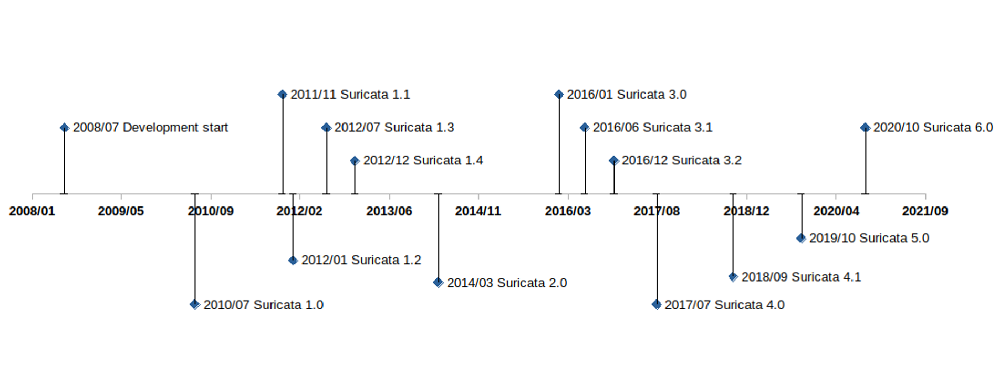
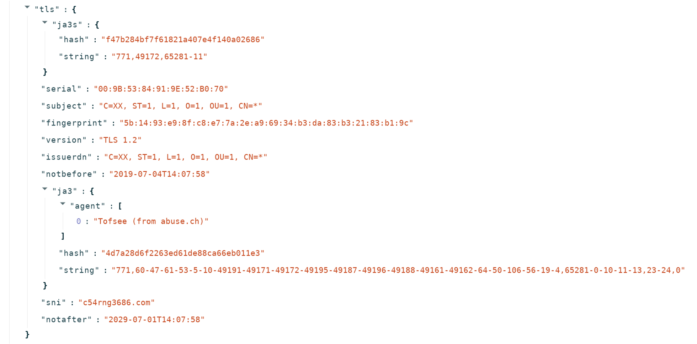
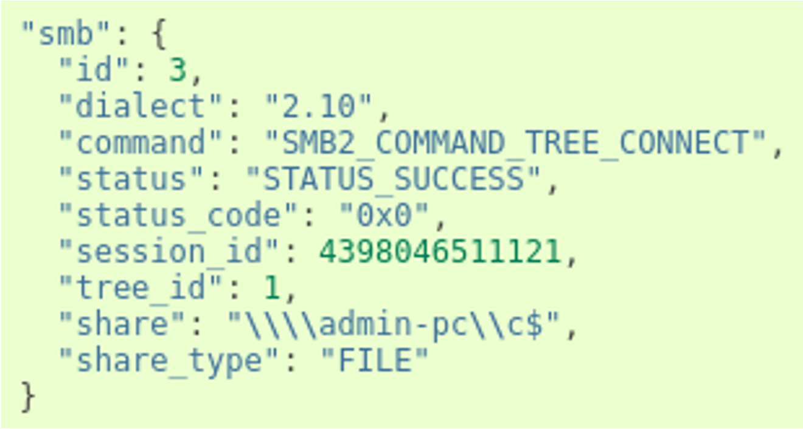

Introduction to Suricata
========================

An Open Source Network Threat Detection engine
----------------------------------------------

Suricata is an open source intrusion detection (IDS), intrusion prevention (IPS), and network security monitoring (NSM) system. It is developed and maintained by a vast community under the guidance of the Open Information Security Foundation (OISF). The project started in 2009, and had its first official release in 2010.

The original goal of the Suricata IDS project was to develop an intrusion detection engine based on signatures, similar to its ancestor Snort but with different technological choices. The aim was to build a network IDS that would share the same detection language as Snort and have a strong focus on community. The early technology choices were to implement multi-threading, advanced HTTP support, and a port-independent protocol recognition.

Over the following dozen years or so, the project—made possible thanks to public funding—has continued to evolve. Overseeing the evolution of the platform is the OISF, a non-profit organization created to receive the funds and take care of promoting and organizing Suricata’s growth.

Most of the funding for the project now comes through private organizations via consortium membership. The foundation and the consortium members play a significant role in advancing the technology, but Suricata development has always been and remains a community undertaking.

People outside the foundation have made revolutionary proposals, which have profoundly changed the face of the project. They have helped Suricata to evolve over the years in order to stay current, attractive, and focused on threat detection. The timeline below illustrates some of the major Suricata milestones.

  
   Timeline of major Suricata versions.

12 years of innovation
----------------------

Suricata 1.0 (July 2010) - Welcome to the HTTP World
~~~~~~~~~~~~~~~~~~~~~~~~~~~~~~~~~~~~~~~~~~~~~~~~~~~~

Understanding the HTTP protocol was by far the most important breakthrough in the first release. Suricata 1.0, published in July 2010 after two years of development, was able to read a Snort ruleset but could use a series of new keywords to look for content in the protocol fields of HTTP using a port-agnostic approach.

For the first time, a signature could ask for a specific protocol field without having to do the protocol parsing by itself. Because of this, the complexity of the writing of signatures was decreased while, at the same time, performance was increased. Techniques such as multi-pattern matching enabled accelerated searches in these specific fields.

Another important feature of Suricata 1.0 was protocol recognition. The engine analyzes the beginning of the exchange on a stream to find out what protocol it is - completely independent of the Layer 4 port. This port-agnostic feature had a big impact in terms of detection rate, as a lot of malware at that time was using a high numbered port to connect to command and control servers and HTTP to exchange information. By being able to find HTTP independently of the port - a big accomplishment - it allowed Suricata to accurately detect the malware.

Suricata also offered multi-step detection thanks to the inclusion of keywords that were the first step toward overcoming the low expressivity of the signature language inherited from Snort.

For example, the “flowbits” keyword family provided a way to pass information between signatures, and thus allow users to construct a state engine. While it was limited to the description of the state inside a single flow, it was real progress.

One other feature of this first release broke with the previously strict definition of what an IDS was: logging HTTP requests to a file. This was not in the initial specifications, but it turned out to not be too complex to build and did not have a major impact on performance. This opportunistic approach continues to uniquely define all Suricata development.

Suricata 1.2 (January 2012) - File Extraction
~~~~~~~~~~~~~~~~~~~~~~~~~~~~~~~~~~~~~~~~~~~~~
File transaction info was added with version 1.2, released in January 2012 and was extended in version 1.3, released six months later. Understanding the HTTP protocol gave Suricata the visibility to see what was transmitted in requests, so it was natural to perform an extraction of the transmitted files.

This was added in version 1.2, along with file checksum computation and file transaction logging. In Suricata 1.3, the keyword “filemd5” was added to verify if the md5 checksum of the transmitted file was present in a list stored in a file. The feature would be extended later to sha1 and sha256, with the “filesha1” and “filesha256” keywords.

Note: extraction of files using SMTP protocol was contributed by BAE Systems in Suricata 2.1.

Suricata 0.3 (July 2012) - Transport Layer Security (TLS)
~~~~~~~~~~~~~~~~~~~~~~~~~~~~~~~~~~~~~~~~~~~~~~~~~~~~~~~~~

In July 2012, Suricata 1.3 was released and with it came support for TLS -- contributed by Pierre Chifflier working for ANSSI, the French agency responsible for cyberdefense. This TLS implementation does not include decryption but is instead an analysis of the TLS handshake with extraction of unique transaction characteristics such as certificate subject, issuer, and its fingerprint.
At this stage, it is clear that Suricata is making the shift away from the classic role of IDS as the presenter of simple data. The system is embracing complex decoding and extracting data that is simply not visible to the naked eye. This began with HTTP message decompression and continued from this point forward.

This TLS support is now used to address the evolution of malware that began to use encrypted communication. For example, currently available signatures now readily detect connections to servers using default OpenSSL configurations.

Dedicated TLS keywords were also added with this release, and all TLS events are logged into a dedicated file.

This mixed approach - using both IDS and network security monitoring (NSM) at the same time - builds upon what was done with HTTP. And will prove to be the norm going forward. That is, for each new protocol supported: adding the dynamic protocol identification, logging events, offering dedicated keywords, and extracting files.

The evolution of TLS support has continued over multiple versions of Suricata.

Suricata 1.4 (December 2014) - Support for Lua
~~~~~~~~~~~~~~~~~~~~~~~~~~~~~~~~~~~~~~~~~~~~~~

With Suricata 1.4 in December 2014, Suricata added a second major signature language in Lua, a lightweight, multi-paradigm programming language designed primarily for embedded use in applications.
Signatures could now include a Lua script as a feature. This script uses Suricata-exposed buffers such as the packet content or the TLS information, and its return value is 1 for a match and 0 for no match. The Lua script may also create or modify flowbits variables.

With this added capability, Suricata now had a real programming language that could be used by the system to save states. This opened up a range of possibilities. The Lua support, for instance, could be used to write a very accurate signature to detect Heartbleed attack attempts. In fact, that signature was available a few hours after an attack was announced, and it would be the only IDS signature-based approach to provide accurate detection of Heartbleed.

Unfortunately, Lua support did not have the success that the development team had expected - and for a trivial reason. In order to be evaluated with the signature, the Lua script for a signature must be inserted as a file next to the signatures file. But adding this type of file was not supported by the existing signature/rule management tools, and no major threat research organizations distributed signatures with Lua for this simple reason. Interest in Lua still exists today, and the increased activity around signature management tools means there is still some hope for the Lua signatures.

Suricata 2.0 (March 2014) - Welcome JSON
~~~~~~~~~~~~~~~~~~~~~~~~~~~~~~~~~~~~~~~~

Suricata 2.0 was published in March of 2014, and it marked a major milestone in the evolution of Suricata. This came with the addition of JSON as the preferred format for Suricata-generated events. Thanks to this contribution from Tom Decanio, the project was finally leaving the 1990s as JSON replaced the non-structured text format or binary format such as unified2. JSON provided an easy-to-extend and easy-to-use format for all Suricata events.

Thanks to JSON formatting, sending Suricata-generated data to tools such as the Elastic stack or Splunk was easy to do. And it came with a native “correlation” capability that can be made using the name of the fields used. A source IP is always the “src_ip” field. On top of that, all events can now be found in one file (by default), containing different types of logs, alerts, and/or separate DNS, SSH, TLS, HTTP transactions, for example, and even performance data.

   TLS event in JSON form.

On the intrusion detection side, having an alternative to the unified2 format was a big improvement. This binary format dedicated to alerts only supported IP fields, the payload, and basic information about the signature Unfortunately, it was almost impossible to extend it to add more context information to the alerts.

Suricata now supported more and more protocols, so it was possible to add contextual information to alerts. Being able to look at the extracted fields and run statistics on them has the potential to make the job of the analyst simpler and more efficient.

For Suricata 2.1, this philosophy was embraced more completely, by adding application layer metadata in the alerts, starting with HTTP. The work on this feature continued throughout the release, and metadata were added for many other protocols. Later in version 4.0, this logic was pushed further by adding the logging of the HTTP body. These fields are often compressed, so logging the content was not directly useful. Providing the decompressed data did, however, allow for direct analysis.

Suricata 3.0 (January 2016) - Debut of Xbits Keyword
~~~~~~~~~~~~~~~~~~~~~~~~~~~~~~~~~~~~~~~~~~~~~~~~~~~~

Suricata 3.0 was published in January 2016, with the primary new feature being the “xbits” keyword. The concept of xbits is to go beyond the limitations of flowbits, which could not be used in multi-flow attacks. Xbits is an evolution of flowbits, in which the variable is attached to an IP address or to an IP pair. Signatures can then collaborate inside a state machine that is not limited to a single flow.

Suricata 4.0 (July 2017) - In Rust we Trust
In addition to support for a number of new protocols, Suricata 4.0 introduced a more secure and efficient common parsing technique into the core. Using a combination of the Rust language and Nom parser (see https://github.com/Geal/nom), it set the stage for the rapid increase in the protocols supported by Suricata without sacrificing security and stability of the engine. This will prove critical for paving the way for the complete NSM functionality.

On the functional side, Network File System (NFS) and Network Time Protocol (NTP) were the two big protocol additions in version 4.0.
Support for several other new protocols - namely Server Message Block (SMB) and Dynamic Host Configuration Protocol (DHCP) - was added in release 4.1. These are used mainly in internal networks and with their support Suricata can more effectively analyze internal traffic, providing two primary benefits: firstly, increased visibility in encrypted environments; secondly, providing more complete detection of threats as they move laterally within a network.

Suricata 4.1 (December 2018) - Samba Time
~~~~~~~~~~~~~~~~~~~~~~~~~~~~~~~~~~~~~~~~~

The major highlight of Suricata 4.1 was the support for the SMB protocol family. Complete protocol support was added, including dedicated keywords, metadata logging, and file extraction. The impact on the deployment of Suricata on internal traffic has been quite huge. The metadata records are complete and enable a fine-grained analysis strategy to be created. The following event is an example of a transaction on a share:

   SMB sub object in an smb event.

Suricata 5 (October 2019) - Introduction of Datasets
~~~~~~~~~~~~~~~~~~~~~~~~~~~~~~~~~~~~~~~~~~~~~~~~~~~~

The introduction of datasets was the primary enhancement included with Suricata version 5, released in October 2019. This added the ability to match on a list of more than 50 different buffers, and check a list of hostnames against a “known bad” database in the HTTP hostname or in the TLS Server Name Indication, or check an HTTP user agent list.

Importantly, these lists may include a few items or millions of them, without degrading the system performance. This is a key feature, considering the trend toward threat intelligence sharing and the use of tools such as MISP.

One other very interesting aspect of datasets is Suricata’s capability to add and delete elements from a set using signatures to trigger these changes. This feature has, for example, been used to create a learned list, tracking what is seen on the network and when and to build a new class of machine-learning based detection.

Suricata 6 (October 2020) - Additional Protocol Support
~~~~~~~~~~~~~~~~~~~~~~~~~~~~~~~~~~~~~~~~~~~~~~~~~~~~~~~

The primary contribution of Suricata 6 was to increase the body of supported protocols. From a user perspective, the introduction of HTTP/2 support was critical. Given that almost half of the top 10 millions websites are supporting this protocol, it was essential for Suricata to be able to log HTTP/2 protocol transactions and run threat detection on it.

This version also added support for other important protocols, including Message Queuing Telemetry Transport (MQTT, contributed by DCSO) for Internet of Things (IoT) environments, and Remote Frame Buffer (used for remote desktop sessions).

Although it was an “under the hood” feature, the switch to an internally developed JSON generator in Suricata 6 is worth mentioning. With users deploying Suricata in 100 Gbps environments and with application layer logging being an important feature, the number of events per second generated can be quite high. For example, it is not uncommon for a 100 Gbps deployment to generate hundreds of thousands events per second on a single probe. As a consequence, the generation of JSON events using the original libjansson library ended up being a bottleneck. With Suricata 6, this was replaced by a custom JSON generator written in Rust which significantly lowers the performance burden of logging.

