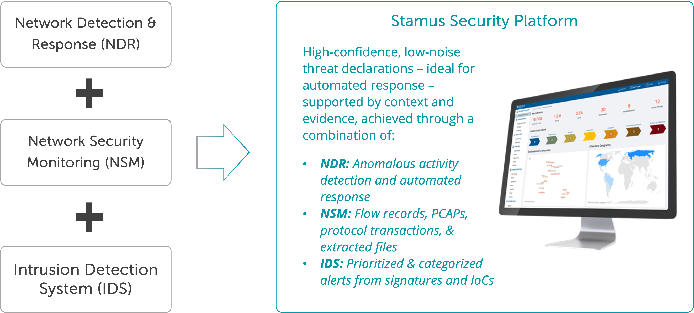
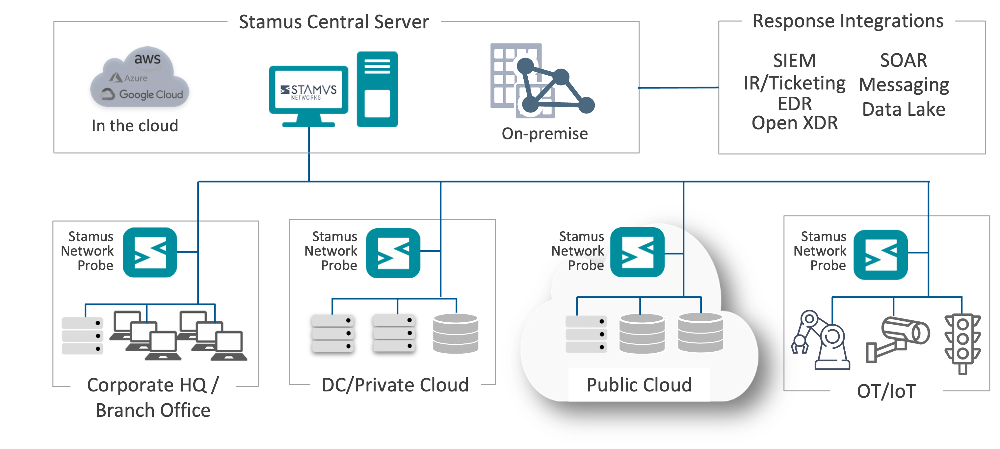

About Stamus Networks
=====================

Stamus Networks is the global leader in enterprise class Suricata-based network security.

Stamus Networks was founded in Paris, France by Éric Leblond and Peter Manev in 2014 who wanted to build a company committed to developing powerful tools that help defenders do their jobs easier and more effectively. They selected the company name based on the Latin word “Stamus” which means “we stand” as a reminder of that promise.

A Company Built on Suricata Expertise
-------------------------------------

Éric is a board member and Peter is an executive team member of the Open Information Security Foundation (OISF). Both are active contributors to the Suricata project, the open source high-performance intrusion detection (IDS) and network security monitoring (NSM) engine which is governed by the OISF. Stamus Networks supports the Open Information Security Foundation through its membership in the OISF Consortium. 

Under the leadership of Éric and Peter, Stamus Networks applies its extensive Suricata and network security technology experience to develop its advanced network-based threat detection and response solutions. 

The company's team of world-class network security and open source experts apply critical new technologies such as advanced analytics and machine learning to this strong foundation while preserving the openness, configurability, interoperability, and transparency that their customers have come to expect from their current security infrastructure.

Other Open Source Contributions
-------------------------------

Stamus Networks has a long history of developing and supporting open source technologies. 

In addition to extensive contributions to Suricata itself, the team at Stamus Labs have six active projects underway.

 - Since 2014, Stamus Networks has developed and maintained SELKS, the popular turnkey Suricata-based open source intrusion detection system (IDS), Network Security Monitoring (NSM), and threat hunting system. Whilst building SELKS, Stamus Networks created nearly 30 dashboards comprised of over 400 visualizations for use with data generated by Suricata with any Elastic stack. These dashboards can also be used separately.
 - In 2020, Stamus Networks introduced the Stamus App for Splunk which is a free and open source Splunk app for investigating and hunting in the IDS alert data and protocol transaction logs generated by Suricata sensors. This Splunk app also provides complete access to data from Clear NDR Enterprise.
 - Also in 2020, Stamus Networks introduced GopherCAP, an innovative PCAP manipulation application that provides accurate playback of extra large PCAP files directly from tar archives.
 - In January 2022, Stamus Networks introduced the Suricata Language Server, a tool that adds syntax checking, performance guidance, and auto-completion to popular text editors for Suricata signature developers. 
 - In November 2022, the company published the "Security Analyst's Guide to Suricata" - the world's first practical guide for unlocking the full potential of Suricata. Co-authored by Éric and Peter, it is written for security operations center (SOC) analysts and threat hunters who use Suricata to gain insights into what is taking place on their networks. The book provides vital information on entry points and in-depth analysis on the most important Suricata features.
 - Also, in November 2022, Stamus Networks introduced a free Suricata ruleset specifically focused on detecting lateral movement in Microsoft Windows environments
 - In 2023, Stamus Networks introduced Jupyter Playbooks for Suricata
 - Also in 2023, Stamus Networks introduced a set of free newly-registered domain threat intelligence feeds, optimized for Suricata.
 - In 2024, Stamus Networks announced a Clear NDR Community, a free and open source version of Clear NDR Enterprise that is the successor of SELKS.

Visit `Stamus Labs page <https://www.stamus-networks.com/stamus-labs>`_ to learn more.

Stamus Networks Today
---------------------

Today, Stamus Networks supports customers in 13 countries and maintains offices in eight countries around the world. The company is focused on helping enterprise security teams accelerate their response to threats with solutions that uncover serious and imminent risk from cloud and on-premise network activity. The company’s advanced network detection and response (NDR) systems expose threats to critical assets and empower rapid response.

Stamus Networks is a trusted partner to many of the world’s most targeted organizations, including government CERTs, central banks, insurance providers, managed security service providers, financial service providers, multinational government institutions, broadcasters, travel and hospitality companies, and even a market-leading cybersecurity SaaS vendor.

Unlike other network security companies, Stamus Networks delivers truly useful detection with explainable results at enterprise scale by applying the right technologies to the right problems, while avoiding the hype, fear and exaggeration that is often employed by security vendors.

Technology Proven in NATO Cyber Exercises
-----------------------------------------

For more than five years, Stamus Networks and Clear NDR have been invited by the NATO Cooperative Cyber Defense Center of Excellence (CCDCOE) to join their annual Locked Shields and Crossed Swords live fire exercises where the company refines and validates its latest threat detection capabilities. 

The Clear NDR Enterprise™ (Clear NDR) 
-----------------------------------
Clear NDR Enterprise™ (Clear NDR) is an open network detection and response solution (NDR) built on a Suricata foundation that delivers actionable network visibility and powerful threat detection to enterprise security teams.

By combining the best capabilities of intrusion detection systems (IDS), network security monitoring (NSM), and network detection and response (NDR), Clear NDR Enterprise is a new generation of NDR that helps organizations expose serious threats and unauthorized activity lurking in their network.

This helps reduce tool sprawl and helps organizations meet their governance, risk, compliance, and operational security challenges with a single consolidated solution.

Organizations select Clear NDR Enterprise for one or more of the unique capabilities it brings them: 

 - **Greater visibility into threats & activity** - By using multiple detection technologies and guided threat hunting users uncover even the weakest attack signals and unauthorized activities hiding in the network.
 - **Transparent detections with detailed evidence** - Understand exactly what triggered an event with a detailed attack timeline along with all the evidence needed to respond quickly and stop a breach before damage is done.
 - **Open and extensible for any environment** - Users can augment Clear NDR’s built-in detections with third party threat intel and signatures or develop their own custom detections. Clear NDR can easily integrate into nearly any existing security tech stack.
 - **Built for enterprise-scale operations** - Clear NDR scales from a small stand-alone instance to multi-site, multi-100Gbps deployments integrated into the SOC/SIEM/SOAR while tracking activity of millions of hosts.
 - **Optional air-gapped deployment** - Optionally deploy our central analytics system on premise or in your datacenter, so you do not ship sensitive information to a SaaS-based system. And Clear NDR may even be deployed in a completely air-gapped environment.
 - **Use Stamus Network Probes or existing Suricata sensors** - Use Clear NDR to supercharge existing Suricata deployments.  Organizations can start with their existing Suricata sensors, while transitioning to the more advanced Stamus Network Probes.

 The network "perimeter" has expanded dramatically and so has the attack surface in most organizations. In order to eliminate blind spots, it is crucial to monitor the network for east-west and north-south traffic at all these sites. Clear NDR Enterprise™ is designed to do just that.

Clear NDR Enterprise consists of two components: Stamus Network Probe(s) and Stamus Central Server which may be deployed in private cloud, public cloud, on-premise, or hybrid environments.

Stamus Network Probes
~~~~~~~~~~~~~~~~~~~~~

Stamus Network Probes™ inspect and analyze all network traffic using deep packet inspection (DPI) to perform real-time threat detection, enrich the resulting events with extensive metadata, and capture network protocol transactions, flow data, extracted files, and full packet capture (PCAPs).

The probe delivers all this data to the Stamus Central Server™ for additional analytics, processing, and another layer of threat detection.

Stamus Central Server
~~~~~~~~~~~~~~~~~~~~~

Stamus Central Server™ provides the centralized management of the probes, third party threat intelligence and rulesets, consolidated event storage, and a central integration point.

It includes an additional layer of machine learning and algorithmic threat detection, along with automated event triage – enabled by tagging and classification. Finally, the Stamus Central Server provides a powerful threat hunting and incident investigation user interface.

Straightforward Licensing
~~~~~~~~~~~~~~~~~~~~~~~~~

Pricing for Clear NDR Enterprise is based on the number of links being monitored and the speed of those links. This simple licensing model supports an unlimited number of users and hosts.

Clear NDR is available in two simple license tiers to fit the needs of the organization. The table below summarizes the differences between these two license tiers.

+------------------------------------------------------------------+---------------------+----------------------+
|                                                                  | Clear NDR Community | Clear NDR Enterprise |
+==================================================================+=====================+======================+
| Signature and reputation list-based threat detection             | ✓                   | ✓                    |
+------------------------------------------------------------------+---------------------+----------------------+
| Flow and protocol-based data enrichment and event capture        | ✓                   | ✓                    |
+------------------------------------------------------------------+---------------------+----------------------+
| Tagging and classification for auto event triage                 | ✓                   | ✓                    |
+------------------------------------------------------------------+---------------------+----------------------+
| Guided threat hunting                                            | ✓                   | ✓                    |
+------------------------------------------------------------------+---------------------+----------------------+
| Machine learning and algorithmic detection engines               |                     | ✓                    |
+------------------------------------------------------------------+---------------------+----------------------+
| Stamus threat intelligence and customized detection              |                     | ✓                    |
+------------------------------------------------------------------+---------------------+----------------------+
| Asset-oriented insights                                          |                     | ✓                    |
+------------------------------------------------------------------+---------------------+----------------------+
| Declarations of Compromise™ - high-fidelity threat notifications |                     | ✓                    |
+------------------------------------------------------------------+---------------------+----------------------+
| Declarations of Policy Violations                                |                     | ✓                    |
+------------------------------------------------------------------+---------------------+----------------------+

Learn More
----------

Visit the `Stamus Networks website <https://www.stamus-networks.com/>`_ to learn more about the company and request a demonstration of Clear NDR Enterprise. 

