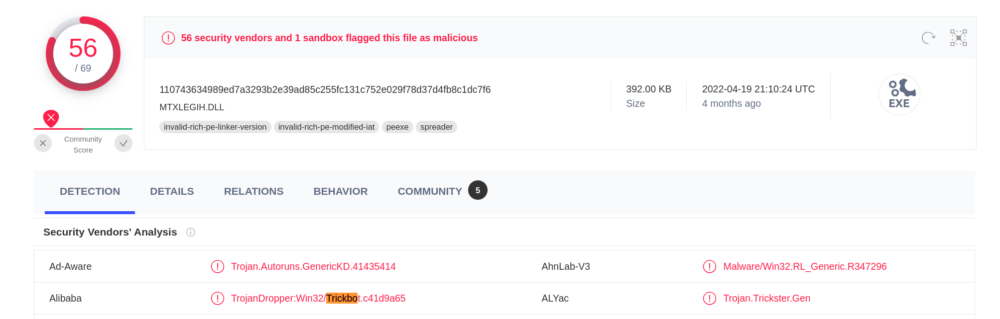

.. _file-analysis:

=============
File Analysis
=============

Introduction
============

Because Suricata understands most major application layers, it is able to track the file transfered over the wire. The list of application layers supporting file extraction includes:

 - HTTP
 - FTP
 - SMB
 - NFS
 - SMTP
 - HTTP2 

Interesting features result from this. First, it allows Suricata to generate events containing information about the files. The :ref:`fileinfo events <fileinfo-events>` are generated once any tracked file transfer is over (independantly of any detection). These events contain details about the file such as its name, various hashes of its content (sha1, sha256, ...), and identification of the file type based on its content.
 
The second interesting feature is the extraction of the file which is triggered by the `filestore <https://suricata.readthedocs.io/en/latest/rules/file-keywords.html?#filestore>`_ keyword in signature. Extraction can also be switched on globally, but it is really intensive in term of performance. One thing to mention about extraction is that it is deduplicated as the storage of the file on the disk is done once per sha256.

The third feature associated with the file is the analysis of file content that can be done via the `file_data` keyword. Signatures can be written to match on the content of a file which, for example, can be compressed in the case of HTTP or under a base64 encoded form in the case of SMTP.

Please see the Suricata manual for how to set up `file extraction <https://suricata.readthedocs.io/en/latest/file-extraction/file-extraction.html>`_.

.. index:: Fileinfo event

.. _fileinfo-events:

Fileinfo events
===============

The structure of a `fileinfo` event is as follows:

.. code-block:: JSON

  {
    "timestamp": "2019-07-05T22:01:04.745891+0200",
    "flow_id": 2209746386047329,
    "pcap_cnt": 33861,
    "event_type": "fileinfo",
    "src_ip": "5.188.168.49",
    "src_port": 80,
    "dest_ip": "10.7.5.101",
    "dest_port": 49686,
    "proto": "TCP",
    "community_id": "1:shQmhcocLIrJ1WtOAbgShXgB5FY=",
    "http": {
      "hostname": "5.188.168.49",
      "url": "/sin.png",
      "http_user_agent": "WinHTTP loader/1.0",
      "http_content_type": "image/png",
      "http_method": "GET",
      "protocol": "HTTP/1.1",
      "status": 200,
      "length": 110718
    },
    "app_proto": "http",
    "fileinfo": {
      "filename": "/sin.png",
      "magic": "PE32 executable (GUI) Intel 80386, for MS Windows",
      "gaps": false,
      "state": "CLOSED",
      "sha1": "2408c5380ddca2bbd53b87c27132b72f0927c70f",
      "sha256": "110743634989ed7a3293b2e39ad85c255fc131c752e029f78d37d4fb8c1dc7f6",
      "stored": false,
      "size": 369664,
      "tx_id": 1
    }
  }

The event contains a `fileinfo` object that contains the following fields:

 - `filename` announced by the servers
 - `magic` computed by analyzing the beginning of the file
 - `size` to receive the file size

It also contains a regular `http` subobject as this file was captured on an HTTP flow. On a different application's layers, a different subobject would have been present. The field `app_proto` is a good way to know which suboject will be present. 

This event is a good example of the value of the various mechanisms in place in Suricata. The HTTP parser told us that the file content type (`http.http_content_type`) announced by the server is an 'image\png'. This would be fine if the analysis of content of the file did not find out (in the key `fileinfo.magic`) that the file is, in reality, an executable. For reference, this file was used in an infection by the Trickbot malware.

This can be confirmed by checking the sha1 or sha256 hash of the file in `Virustotal <https://www.virustotal.com/gui/file/110743634989ed7a3293b2e39ad85c255fc131c752e029f78d37d4fb8c1dc7f6>`_. This file is flagged as malicous by more than 50 security vendors and associated to Trickbot by some of them as well.

  
   Information from Virustotal on the file.

Detection on tracked files
==========================

file.data keywords
------------------

The `file.data` keyword matches on the content of the file, so it can be used to do an analysis of the content of the transferred file with the inspection capability of Suricata. This keyword is aliased to `file_data` (which is used in a lot of available signatures as it is the original name). The keyword alias `file.data` is a sticky buffer, so it will trigger matching on the file content for all subsequent match keywords.

Let's take an example with the following signature from the Emerging Threats ruleset:

.. code-block::

  alert http $EXTERNAL_NET any -> $HOME_NET any ( \\
    msg:"ET SCADA PcVue Activex Control Insecure method (AddPage)"; \\
    flow:to_client,established; \\
    file.data; content:"<OBJECT "; nocase; content:"classid"; nocase; distance:0; \\
       content:"CLSID"; nocase; distance:0; \\
       content:"083B40D3-CCBA-11D2-AFE0-00C04F7993D6"; nocase; distance:0; \\
       content:".AddPage"; nocase; \\
       content:"<OBJECT"; nocase; \\
       pcre:"/^[^>]*?classid\s*=\s*[\x22\x27]?\s*clsid\s*\x3a\s*\x7B?\s*?083B40D3-CCBA-11D2-AFE0-00C04F7993D6/Rsi"; \\
       reference:url,exploit-db.com/exploits/17896; classtype:attempted-user; \\
       sid:2013730; rev:4; \\
    )

This is triggering on https://www.exploit-db.com/exploits/17896 that is a DOS on Activex. This signature is over the HTTP protocol and it is using the `file.data` keyword. This happens because the HTTP protocol is usually compressing the data sent from the server to lower the bandwith. As a result, a simple match on the content would have failed. By using a content match on `file.data`, we ensure a correct match on the content that is seen by the browser  even if there is server-side compression as Suricata will uncompress the content to pass the clear text content to the `file.data` keyword.

The matching done in the signature is an interesting use of sticky buffer. It first does multiple content matches to check that all fixed string parts
of the attack are there. This lowers the risk of evaluating the costly regular expression that is used as a final check for the presence of the
attack in the server message.

Magic analysis
--------------

Among the keywords dealing with the file, we find `file.magic`. This is a sticky buffer matching on the result of Magic inspection.
This can, for example, be used to detect the executables masqueraded as an image seen in the previous section:

.. code-block::

  alert http any any -> any any (msg:"masquerade file"; \\
        http.content_type; content:"image"; \\
        file.magic; content:"executable";)

Another simple possibility offered by `file.magic` is file extraction selection. For example, to extract all PDF to disk, one can use:

.. code-block::

  alert tcp any any -> any any (msg:"PDF extraction"; \\
        file.magic; content:"pdf"; nocase; \\
        filestore;)

Known bad and known good list
-----------------------------

If checksum of file is really interesting information found in the `fileinfo` events, they can also be matched on via the `filemd5 <https://suricata.readthedocs.io/en/latest/rules/file-keywords.html#filemd5>`_,
`filesha1 <https://suricata.readthedocs.io/en/latest/rules/file-keywords.html#filesha1>`_, and 
`filesha256 <https://suricata.readthedocs.io/en/latest/rules/file-keywords.html#filesha256>`_ keywords. All of these work the same way: they are given a file as an argument that has to contain one checksum per line and they will match if the checksum of the file is on the list (or not if the match is negated). 

For example, to alert on all excutables that are not on the list of known good executables (built from another tool), one can use:

.. code-block::

  alert smb any any -> any any (msg:"Unknown executable file on SMB"; \\
        filesha256:!sha256-goodexe; \\
        file.name; content:".exe"; endswith; \\
        sid:1; rev:1;)

Threat hunting with file
========================

Masqueraded files
-----------------

The masqueraded files described in :ref:`fileinfo-events` can be detected by looking at the `fileinfo` events.

In Elasticsearch, you can simply detect executable masqueraded as PDF with the following request:

.. code-block::

  fileinfo.filename.keywords:*.pdf AND fileinfo.magic:"executable"

You can also be more generic with querying all executables that do not end up with a regular extension:

.. code-block::

  fileinfo.magic:"executable" -fileinfo.filename.keyword:*.exe -fileinfo.filename.keyword:*.dll -fileinfo.filename.keyword:*.com

And if you want to zoom on internal protocol, you can do:

.. code-block::

   (app_proto:"smb" OR app_proto:"nfs") AND  \\
      (fileinfo.magic:"executable" -fileinfo.filename.keyword:*.exe -fileinfo.filename.keyword:*.dll -fileinfo.filename.keyword:*.com)

Splunk users can write this last one with:

.. code-block::

   app_proto IN ("smb", "nfs") |
     regex fileinfo.magic = "(?i)executable" |
     NOT (fileinfo.filename="*.exe" OR fileinfo.filename="*.dll" OR fileinfo.filename="*.com")

Long file name
--------------

The file names are usually kept short when they are linked to legitimate behavior because nobody likes to type
or read lengthy strings. Because of this, it is interesting to look at any executable file transfer where the filename is 
at least 15 characters long and does not finish on ".exe" (installers could have a longer name). 

This can be done with:

.. code-block::

  fileinfo.type:"executable" AND fileinfo.filename.keyword:/.{15}.*/  \\
    -fileinfo.filename.keyword:*.exe

Entropy on SMB file transfer
----------------------------

`Entropy <https://en.wikipedia.org/wiki/Entropy_(information_theory)>`_ is the next logical step after looking into a long filename because it measures the randomness of the data. In a lot of cases, malware uses randomly generated file names to avoid collision with existing files.

Entropy can be computed in Splunk by using the `URL Toolbox App <https://splunkbase.splunk.com/app/2734/>`_. For example, let's compute the entropy of the executable filename and get the list of filename sorted by entropy: 

.. code-block::

  event_type=fileinfo app_proto=smb |
  regex fileinfo.magic = "(?i)executable" |
  `ut_shannon(fileinfo.filename)` |
  eval entropy = round(ut_shannon, 2) |
  stats min(timestamp), max(timestamp) by fileinfo.filename, entropy, fileinfo.sha256 |
  sort -entropy

An entropy value of 4 is already high with regards to a filename, so filtering on value can allow you to focus on suspect elements.

