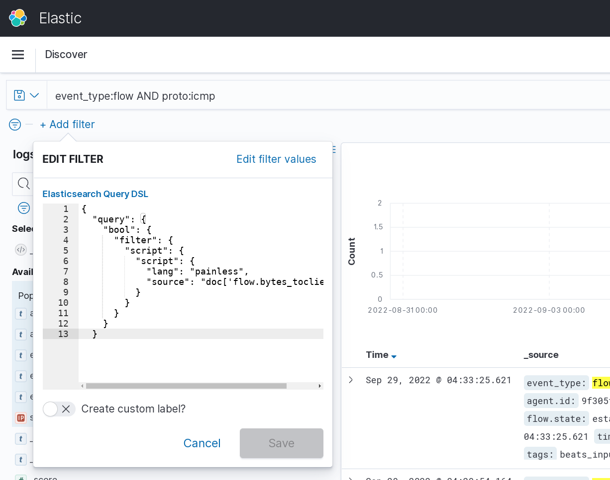

=============
Flow Analysis
=============

Introduction
============

Flow data, also known as `Netflow <https://en.wikipedia.org/wiki/NetFlow>`_ data, is a well known network analysis tool that has long been used for
security purposes. The concept, which was introduced by Cisco in 1996, centered around doing accounting on sessions. Basic information found in flow data includes the number of bytes and packets, the start and end time of a flow, and the IP information needed to identify the flow. 

The concept of a session is straight forward for TCP, but for sessionless protocols an approximation is used based on an internally defined timeout.
For example, a flow on UDP will be opened when a client sends data to a server from a given port and to a given port. It will end when no information
is sent one way or another for a predefined duration. The timeout really depends of the systems collecting the information, and in the case of Suricata
it can be setup per protocol.

Flow events in Suricata
=======================

Suricata generates its own flow log independent of other events like alerts or protocol logs. It internally tracks UDP, TCP, SCTP, and ICMP for analysis purpose and
uses the collected information to generate entries for every flow.

There are two types of flow events:
- ``flow``: one entry per flow so volumetry for client and server data is available in the same event
- ``netflow``: two entries per flow, client and server accounting are in 2 different events

The ``flow_id`` key is obviously present in flow and can be used to correlate flow data with other events. In the case of netflow, it is used to correlate both sides of the flow.

A typical ``flow`` entry looks like the following:

.. code-block:: JSON

  {
    "timestamp": "2021-11-17T23:43:24.129401+0100",
    "flow_id": 1115914617724757,
    "in_iface": "enp5s0",
    "event_type": "flow",
    "src_ip": "2a02:1511:5172:1d50:3615:b3a2:a98a:c71f",
    "src_port": 34096,
    "dest_ip": "2a00:87c0:2021:2021:0050:0000:4000:0539",
    "dest_port": 443,
    "proto": "TCP",
    "app_proto": "tls",
    "flow": {
      "pkts_toserver": 3300,
      "pkts_toclient": 6684,
      "bytes_toserver": 334979,
      "bytes_toclient": 9887597,
      "start": "2021-11-17T23:32:59.915179+0100",
      "end": "2021-11-17T23:38:59.483429+0100",
      "age": 360,
      "state": "closed",
      "reason": "shutdown",
      "alerted": false
    },
    "tcp": {
      "tcp_flags": "1f",
      "tcp_flags_ts": "1e",
      "tcp_flags_tc": "1b",
      "syn": true,
      "fin": true,
      "rst": true,
      "psh": true,
      "ack": true,
      "state": "closed"
    }
  }

We find the traditional IP information (``src_ip``, ``src_port``, ``dest_ip``, ``dest_port``) and some information for the application layer
with the key ``app_proto`` that is here set to ``tls``. As this is a ``TCP`` flow, we have a ``tcp`` subobject that contains a set of keys. If
``state`` is coding the state of the session in the TCP engine at the end of the flow, the rest of the keys are coding information about the flags
seen on the TCP session. The boolean values are set to true if the corresponding flag has been seen. The three ``tcp_flags*`` key contain the
hexadecimal value of the integer obtained by setting to 1 all flags seen during the life of the session. ``tcp_flags`` is global, and ``tcp_flags_ts`` stores the information for packets sent to the server while ``tcp_flags_tc`` stores the ones sent to the client.

.. note::

  Check the `eve Flow format <https://suricata.readthedocs.io/en/latest/output/eve/eve-json-format.html?highlight=http#event-type-flow>`_ page in Suricata manual for more information on the flow events.

Flow Analysis
=============

There is a great amount of techniques which use flow to find anomalies in the traffic by applying statistical analysis or machine learning to the events.
We are not going to cover this in this document, but we will showcase some simple examples.

ICMP flow with abnormal size
----------------------------

ICMP flows are usually short as they are mostly used to check connectivity from one point
in the network to another. Being short, the amount of bytes exchanged are usually small.
Some data exfiltration techniques abuse ICMP to send the data out without being noticed.
But in a lot of cases, these techniques send their data on the same flow. So looking
at flows that shows important data transfer (like 150kb for example) is interesting.

Using Lucene syntax, it can be written in Kibana as follows:

.. code-block::

  event_type:flow AND \\
    (proto:"ICMP" OR proto:"IPv6-ICMP") AND \\
    (flow.bytes_toclient:>150000 OR flow.bytes_toserver:>150000 ) AND \\
    flow.bytes_toclient:>0 AND flow.bytes_toserver:>0

In Splunk, one can use:

.. code-block::

  event_type=flow AND
   (proto="ICMP" OR proto="IPv6-ICMP") AND
   (flow.bytes_toclient>150000 OR flow.bytes_toserver>150000) AND
   flow.bytes_toclient>0 AND flow.bytes_toserver>0

High volume DNS flow
--------------------

Similar to the previous example, DNS can also be used for data exfiltration and
a potential consequence of the technique used is the existence of DNS flow where
a big amount of data has been transfered.

Using Lucene syntax, it can be written in Kibana as follows:

.. code-block::

  event_type:flow AND app_proto:dns AND \\
    flow.bytes_toclient:>5000 OR flow.bytes_toserver:>5000

Potential ICMP evasion
----------------------

In a standard environment, the reply to an ICMP query is an ICMP response
that contains the same data. As a result the size of the data in the direction
of the client and in the direction of the server are equal.

Using Splunk, matching events can be obtained by doing:

.. code-block::

  event_type=flow AND proto=icmp AND flow.bytes_toclient!=flow.bytes_toserver

Using Kibana, it is possible to do the same in 2 steps. First define a Query DSL as follows:

.. code-block:: JSON

  {
    "query": {
      "bool": {
        "filter": {
          "script": {
            "script": {
              "lang": "painless",
              "source": "doc['flow.bytes_toclient'].value!=doc['flow.bytes_toserver'].value"
            }
          }
        }
      }
    }
  }

See :numref:`query-dsl` for help on adding this Query DSL filter in discover window:

.. _query-dsl:

  
   Query DSL edition in Kibana.

Then, the following filter can be added to select the ICMP messages:

.. code-block::

  event_type:flow AND proto:icmp
