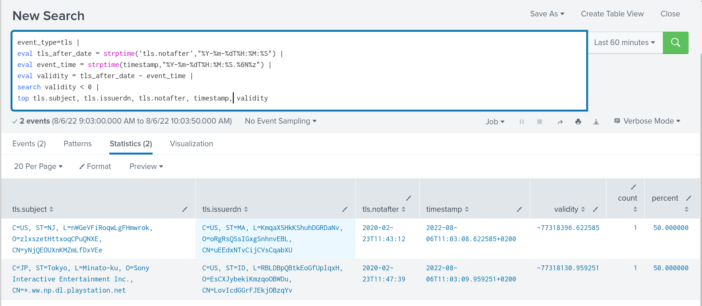
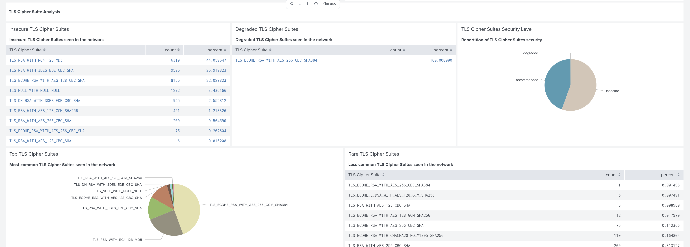

================================
TLS Detection and Threat Hunting
================================

Introduction
============

The TLS protocol is everywhere. The Secure Socket Layer implementation, initially developed for the Mozilla browser, has evolved into one of the most prominent standards. It is widely used in HTTPS and other communications protocols to encrypt communication. Yes, encrypt, which for network security is equivalent of saying, "hide all the juicy details".

But there is still information that can be extracted or built from encrypted communication. This can be used for threat hunting as well as an IDS approach.

Protocol overview
=================

In all versions of TLS, the client is opening a connection to the server and then sending an initial message. It contains the client capabilities in terms of encryption. Using that, the server then replies with potential agreement on encryption technique to use, as well as its certificates. The client analyzes this message and checks that the server certificate is valid. If everything is fine, the client sends its certificates and a seed that is needed to start the encrypted exchange. The server then initiates the encryption and the session switches to encryption.

Before TLS 1.3, the X509 certificate was in clear text. But since TLS 1.3, it is encrypted. As a result, visibility had been really limited with TLS 1.3.

In most implementations, there is a TCP connection and then a TLS handshake, but in some cases the server offers a clear text and an encrypted service on the same port. In this case, a mechanism is needed on the clear text protocol to trigger the switch. In most implementations this is the ``STARTTLS`` message. Most common protocols using this are SMTP, IMAP, and FTP.

TLS analysis in Suricata
========================

TLS handshake analysis
----------------------

Suricata does not decrypt the traffic but rather realizes an analysis of the TLS handshake. By doing this, it manages to extract information on the TLS characteristics as well as on the X509 certificates. This data is written in the ``tls`` event type and are also added to the ``alert`` when they are available.

Suricata can also extract the certificate chain sent by the server and store it inside the event or as a separate file.

Extracted fields
----------------

Suricata extracts information about the TLS handshake and outputs this information in ``tls`` events.

A typical event looks like the following:

.. code-block:: JSON

  {
    "timestamp": "2020-05-08T23:32:34.218590+0200",
    "flow_id": 1737090126716212,
    "pcap_cnt": 41441,
    "event_type": "tls",
    "src_ip": "10.0.0.128",
    "src_port": 52046,
    "dest_ip": "64.233.179.94",
    "dest_port": 443,
    "proto": "TCP",
    "tls": {
      "subject": "C=US, ST=California, L=Mountain View, O=Google LLC, CN=*.gstatic.com",
      "issuerdn": "C=US, O=Google Trust Services, CN=GTS CA 1O1",
      "serial": "74:E6:32:EA:F9:C6:35:C2:02:00:00:00:00:63:98:DD",
      "fingerprint": "f5:af:1c:45:74:1b:2e:f2:5a:85:d1:49:be:dc:97:0d:2e:0c:97:a2",
      "sni": "www.gstatic.com",
      "version": "TLS 1.2",
      "notbefore": "2020-04-15T20:24:10",
      "notafter": "2020-07-08T20:24:10"
    }
  }

Among the interesting fields, we have the ``tls.sni`` which stands for TLS Server Name Indication and is in fact the host name requested by the client. This is sent by the client in the first message to allow the server to choose which certificate to send in his answer. This way the server can honor multiple services on the same port.

In this case, we have the ``tls.subject`` equals to ``"C=US, ST=California, L=Mountain View, O=Google LLC, CN=*.gstatic.com"`` which means because of the ``CN`` field that the certificate can serve any site that matches ``*.gstatic.com``. So we have some supplementary information thanks to the TLS SNI.

.. note::

  Check the `eve TLS format <https://suricata.readthedocs.io/en/latest/output/eve/eve-json-format.html?highlight=http#event-type-tls>`_ page in Suricata manual for more information on the TLS events.

.. index:: TLS JA3

TLS JA3
-------

In a standard TLS handshake, little is known about the client side. This is because the client certificate is not usually familiar nor is it sent over the wire. If we compare this with HTTP, we don't have the user agent field that (even if it is a declarative field) is a valuable source of information,  allowing us to identify and classify protocol clients.

`JA3 <https://github.com/salesforce/ja3>`_ was created by John B. Althouse, Jeff Atkinson, and Josh Atkins (hence the name of the method) to address this issue. It is based on the fact that similar implementations will send similar negotiation parameters in the initial message. By carefully selecting some of these parameters, we can build an identifier that discriminates the implementations with a fine granularity. As with most clever techniques, this looks very simple on the surface, but it has proven to be an incredibly efficient way to fingerprint a TLS client.

Identifying malware traffic with JA3 has proven to be successful even if there is a non-zero false positive.

The following example is a Suricata TLS event with JA3 activated:

.. code-block:: JSON

  {
    "timestamp": "2020-05-08T23:35:24.922820+0200",
    "flow_id": 995065818031171,
    "pcap_cnt": 51204,
    "event_type": "tls",
    "src_ip": "10.0.0.128",
    "src_port": 52047,
    "dest_ip": "144.91.76.208",
    "dest_port": 443,
    "proto": "TCP",
    "tls": {
      "subject": "C=GB, ST=London, L=London, O=Global Security, OU=IT Department, CN=example.com",
      "issuerdn": "C=GB, ST=London, L=London, O=Global Security, OU=IT Department, CN=example.com",
      "serial": "00:9C:FC:DA:1D:A4:70:87:5D",
      "fingerprint": "b8:18:2d:cb:c9:f8:1a:66:75:13:18:31:24:e0:92:35:42:ab:96:89",
      "version": "TLSv1",
      "notbefore": "2020-05-03T11:07:28",
      "notafter": "2021-05-03T11:07:28",
      "ja3": {
        "hash": "6734f37431670b3ab4292b8f60f29984",
        "string": "769,47-53-5-10-49171-49172-49161-49162-50-56-19-4,65281-10-11,23-24,0"
      },
      "ja3s": {
        "hash": "623de93db17d313345d7ea481e7443cf",
        "string": "769,49172,65281-11"
      }
    }
  }

The ja3 part is the following:

.. code-block:: JSON

  {
    "ja3" {
      "hash": "6734f37431670b3ab4292b8f60f29984",
      "string": "769,47-53-5-10-49171-49172-49161-49162-50-56-19-4,65281-10-11,23-24,0"
    }
  }

It is composed of 2 fields: a string that is built by concatenating a predefined list of negotiation parameters and a hash value that is simply the md5 hash of the string.

This hash has been linked to `Trickbot <https://twitter.com/4a4133/status/1043246635239854081?lang=en>`_ by John B. Althouse. So just using this information is enough to identify a potential malware. Even if the server infrastructure is composed of multiple services and evolves, the JA3 of the client will stay the same as the data is based on the client's first message that can not be influenced by the server.

.. index:: TLS JA3S

TLS JA3s
--------

JA3s is almost enough to define what JA3s is. It is a technique similar to JA3 that is used to fingerprint the TLS implementation of server. By analyzing the first message from the server, a predefined list of parameters is concatenated and a md5 hash is built. This leads to the following result in our previous entry:

.. code-block:: JSON

  {
    "ja3s": {
      "hash": "623de93db17d313345d7ea481e7443cf",
      "string": "769,49172,65281-11"
    }
  }

But there is a big difference between JA3 and JA3s. Because the first message from the server is an answer to the client to continue the negotiation, the server message is dependant of the client. As a result, the JA3s is in fact an identifier of a client and server connection more than a server identification. To be fully explicit, two different clients connecting to a server will result in two different JA3s value.

TLS and Detection
=================

TLS keywords
------------

As usual, it is recommended to use all sticky buffers variants as they offer greater flexibility and better performance.

There are two classes of keywords: the one matching the TLS certificate information and the one matching on ja3 and ja3s data.

.. csv-table::
  :file: tls-keywords.csv
  :header-rows: 1

Extensive documentation and syntax explanation is available in Suricata documentation in the `TLS keywords page <https://suricata.readthedocs.io/en/latest/rules/tls-keywords.html>`_.

Cookbook
--------

Detecting expired certificates
~~~~~~~~~~~~~~~~~~~~~~~~~~~~~~

Let's get an alert when one of the servers we monitor has an expired certificate:

.. code-block::

  alert tls $SERVERS any -> any any (msg:"Expired certs on server"; \\
       tls_cert_expired; \\
       sid:1; rev:1;)

Here, we simply use the `tls_cert_expired` keyword and the `$SERVERS` variable that needs to be placed on the left because the certificate data we want to check is coming from the servers.

Checking that internal PKI is used
~~~~~~~~~~~~~~~~~~~~~~~~~~~~~~~~~~

The company we work for is running an expensive Public Key Infrastructure (PKI) and we want to be sure it is used for all the services running on our servers. If the TLS issuer of our PKI is `C=US, O=My Company`, we can simply use the following signature that leverages the `tls.cert_issuer`
sticky buffer keyword.

.. code-block::

  alert tls $SERVERS any -> any any (msg:"Non Company PKI on server"; \\
       tls.cert_issuer; content:!"C=US, O=My Company"; \\
       sid:2; rev:1;)

We use an `!` on the content keyword to negate the match.

If we need to deal with historal data, we can just do a trigger alert for certificates where the beginning of validity is after the date when
the PKI is supposed to be implemented everywhere:

.. code-block::

  alert tls $SERVERS any -> any any (msg:"Non Company PKI on server"; \\
       tls.cert_issuer; content:!"C=US, O=My Company"; \\
       tls_cert_notbefore:>2021-04-01; \\
       sid:2; rev:1;)

Checking Tactiques, Techniques and Procedure on certificate building
~~~~~~~~~~~~~~~~~~~~~~~~~~~~~~~~~~~~~~~~~~~~~~~~~~~~~~~~~~~~~~~~~~~~

Correctly creating TLS certificates is not necessarily a trivial task for either a threat hunter or attacker. For example, some Ursnif campaigns have been using certificates where the subject DN was of the form `C=XX, ST=1, L=1, O=1, OU=1, CN=*`. This `XX` and `1` are not something expected in regular certificates and it is a mark of the Tactics, Techniques, and Procedures (TTP) of the attacker.

This is something we can detect with a signature:

.. code-block::

  alert tls $EXTERNAL_NET any -> $HOME_NET any (msg:"Ursnif like certificate"; \\
       tls.cert_subject; content:"C=XX"; content:"=1,"; \\
       sid:3; rev:1;)

Here, we alert when a certificate on an external server is using a certificate that follows the pattern we have found in the
Ursnif campaign.

Verifying a list of known bad JA3
~~~~~~~~~~~~~~~~~~~~~~~~~~~~~~~~~

.. code-block::

  alert tls $HOME_NET any -> any any (msg:"New internal certificate authority"; \\
        tls.ja3; dataset:set,bad-ja3, type string, load bad-ja3.lst; \\
        sid:4; rev:1;)

Here, we alert as soon as a TLS JA3 from the set of known bad JA3 is seen.

Build the list of internally used certificate authorities
~~~~~~~~~~~~~~~~~~~~~~~~~~~~~~~~~~~~~~~~~~~~~~~~~~~~~~~~~

In a production environment it is useful to know what TLS certificates authorities are using internally. This can be done with Suricata by using the dataset keyword:

.. code-block::

  alert tls $HOME_NET any -> any any (msg:"New internal certificate authority"; \\
        tls.issuerdn; dataset:set,internal-issuers, type string, state internal-issuers.lst, memcap 10Mb, hashsize 100; \\
        sid:5; rev:1;)

Here we alert as soon as a TLS issuer is seen coming from the internal network that has never been seen before.

Hunting on TLS events
=====================

Self signed certificates
------------------------

Self signed certificates can be detected via signatures. See `this blog post <https://www.stamus-networks.com/blog/2015/07/24/finding-self-signed-tls-certificates-suricata-and-luajit-scripting>`_ by Stamus Networks explaining the process using a lua based signature.

This can also be done using the TLS events. If `tls.issuerdn` is equal to `tls.subject`, then we have a self signed certificate.

If you have only the EVE JSON file and access to the command line, you can use `jq` to find them: ::

  cat eve.json | jq 'select(.event_type=="tls" and .tls.issuerdn==.tls.subject)'

In Splunk, one can simply do the following: ::

 event_type="tls" tls.subjectdn=tls.issuerdn

If your data is in Elasticsearch you can do a search in Kibana with DSL filter: ::

  {
    "query": {
      "bool": {
        "must": {
          "script": {
            "script": {
              "inline": "if (doc.containsKey('tls.subject.keyword') && (!doc['tls.subject.keyword'].empty)) { return (doc['tls.subject.keyword'] == doc['tls.issuerdn.keyword']) } else { return false }" 
            }
          }
        }
      }
    }
  }

In some cases, you may have to replace `keyword` by `raw` in your search. You can access Query DSL filter by clicking `+ Add filter` then `Edit as Query DSL`.

Unsecure protocol
-----------------

Some TLS and SSL versions are considered to be unsecure due to design flaws and known successful attacks. Therefore, it is interesting to find any connection using this weak policy so any eye dropping can be prevented. Known unsecure versions are all SSL versions and TLS up to 1.1.

It is possible to search this Elasticsearch by using the following filter: ::

  tls.version:SSL% OR tls.version:TLSv1 OR tls.version:"TLS 1.1"

In Splunk, this can be written as: ::

  event_type=tls AND tls.version IN ("SSLv2", "SSLv3", "TLSv1", "TLS 1.1")

Expired certificates
--------------------

The simplest way to achieve that is to use the `tls_cert_expired` keyword as seen in this signature: ::

  alert tls any any -> any any (msg:"expired certs"; tls_cert_expired; sid:1; rev:1;)

But it is also possible to do this in Splunk: ::

 event_type=tls |
 eval tls_after_date = strptime('tls.notafter',"%Y-%m-%dT%H:%M:%S") |
 eval event_time = strptime(timestamp,"%Y-%m-%dT%H:%M:%S.%6N%z") |
 eval validity = tls_after_date - event_time |
 search validity < 0 |
 top tls.subject, tls.issuerdn, tls.notafter, timestamp, validity

The complex part consists of parsing the two time stamps we are interested in with `strptime` and then computing the validity. The result
of the query is shown on :numref:`splunk-expired-tls`.

.. _splunk-expired-tls:

   Splunk search on expired certificates

TLS Cipher Suite analysis
-------------------------

The negotiated TLS Cipher Suites used in a network are interesting to 
monitor. They contain the set of algorithms used on TLS to protect the communication.
The level of security and confidentiality provided by the various algorithm varies a lot
for instance TLS_NULL_WITH_NULL_NULL is a valid TLS cipher suite and, yes, it means nothing
is done and that data is in clear text. This is for sure, an extreme case but some other
TLS cipher suites are to be avoided like the one using RC4 algorihtm.

If this information is not directly available in Suricata TLS events, it is although available
as one of the TLS JA3S parameter. The second parameter of the JA3S string is indeed
the Cipher ID. This is an integer as TLS is not sending a string over the wire but this
is an interesting information anyway. 

We can use Splunk's extraction capabilities to get the value of the Cipher ID in a distinct field.
All we need to do is to split the JA3S string and get the second element. It can be done as follows.

.. code-block::

  event_type=tls |
    spath tls.ja3s.string output=ja3s_string |
    eval ja3s_elt=split(ja3s_string,",") |
    eval cipher_id=mvindex(ja3s_elt, 1)

Getting from the ID to the string version of the TLS Cipher suite can then be done via a lookup table.
It can be extracted from IANA website. This mapping is available in the 
`Stamus Splunk App <https://splunkbase.splunk.com/app/5262>`_ and it also contains some other interesting
information.

The French National Cybersecurity Agency (`ANSSI <https://www.ssi.gouv.fr/>`_) has published `Security Recommendations for TLS <https://www.ssi.gouv.fr/guide/recommandations-de-securite-relatives-a-tls/>`_ where
a list of recommended TLS cipher suites is defined. Their classification also contains `degraded` TLS cipher suites that are ok to use if there is no
alternative. All other have to be considered as insecure. The mapping included in Stamus Splunk App contains this information in the lookup table
so it is possible to search and do statistics on the security of the TMS Cipher suite seen on the network. For example, to list all insecure 
TLS connections seen on the network, one can do in Splunk:

.. code-block::

  event_type=tls |
    spath tls.ja3s.string output=ja3s_string |
    eval ja3s_elt=split(ja3s_string,",") |
    eval cipher_id=mvindex(ja3s_elt, 1) |
    lookup tls_cipher_mapping.csv id as cipher_id |
    search cipher_security=insecure

Here we add to the previous a call to the lookup followed by a search on the field `cipher_security` that is added by the lookup.

.. _splunk-tls-cipher:

   TLS Cipher Suites analysis in Stamus Splunk App

Using this technique, it is possible to build searches that classify the TLS cipher suites and
display the insecure ones. This is available in one of the Stamus Splunk App dashboard as shown on :numref:`splunk-tls-cipher`.

