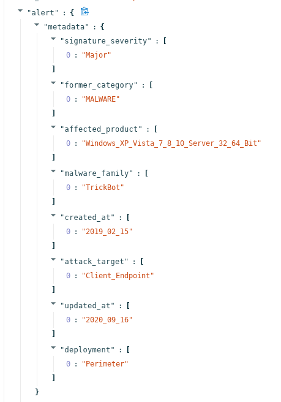
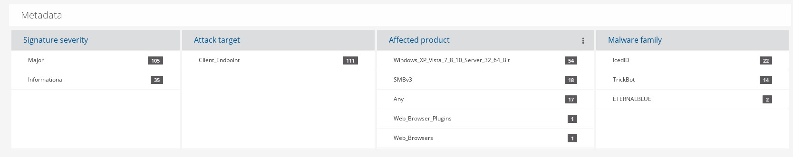
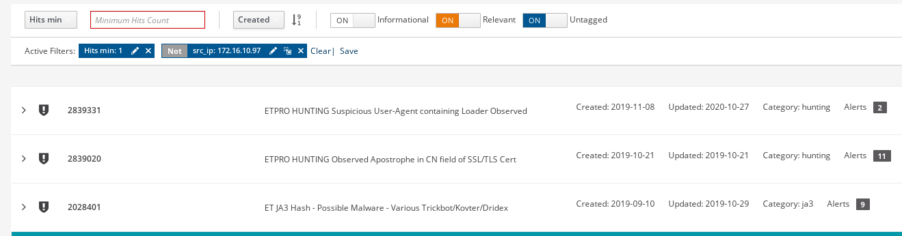
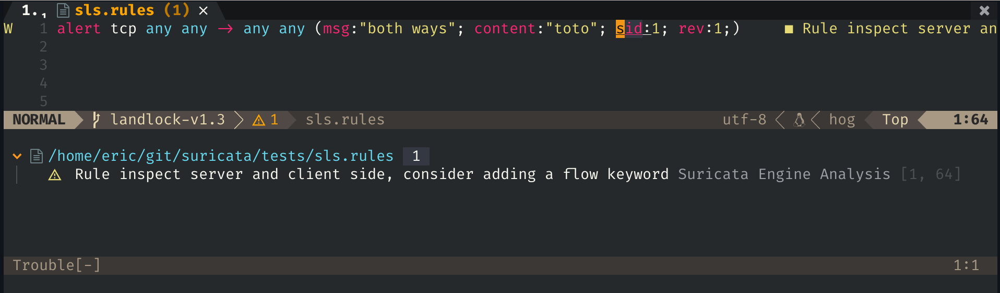
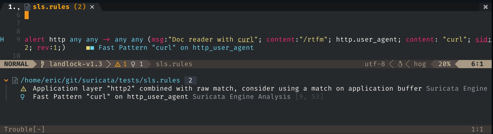
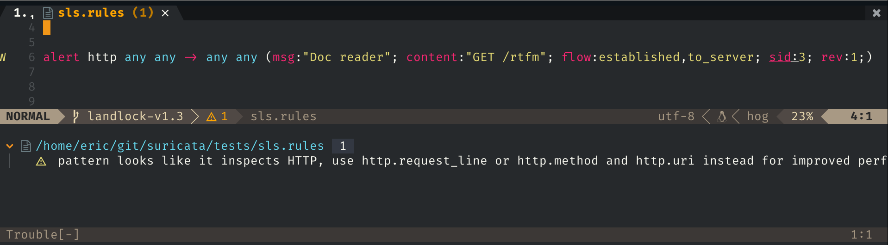

=================================
Writing performant Suricata rules
=================================

Suricata detection engine optimizations
=======================================

The detection engine optimization challenge
-------------------------------------------

In demanding enterprise environments, Suricata must operate at a very high network speeds -- like 40Gbps and 100Gbps -- with the full ETPro ruleset loaded. That ruleset is approximately 60,000 signatures, and in order to keep up with line rate, Suricata must inspect all of them at the rate of 3,333,333 packets per second (for 40Gbps).

So, at 40Gbps there is a budget of .000000000005 seconds per rule. And in this .005 ns per rule, Suricata must do protocol analysis, content matching and execute a regular expression.

In a typical 3GHz CPU, we have a CPU cycle of 3 ns. So using a brute force approach in the detection engine is 3 orders of magnitude too little, even if a test takes only a single cycle.

Thus, some serious optimizations are needed. Scaling via multithreading to use all cores on the system is a key point here, and Suricata does this very well. But even on a one hundred core system, it will only lead to a 100 factor improvement, and this still leaves us with an order of magnitude below the  bare minimum needed for the task.

Running load balancing on the CPU is a key point, but we still cannot address the 60,000 rules. In this case, we would need to reduce the rules processed - we need fewer. But running fewer rules will reduce the threat coverage, so we need to do better.

Grouping signatures
-------------------

This initial approach is quite simple: why should we evaluate a rule on a UDP flow if we are currently inspecting a TCP packet? By doing a protocol split, we can in a perfect case, divide the number of signatures to evaluate by two.

And while we are at it, we can group signatures by protocol port and group network parameters into a tree and place groups of signatures in the leafs.

This is an interesting first step, but I'm sure some readers are already complaining
about the fact that everything in their network is HTTP or TLS. And thus they have only 2 used groups.

Something else is needed.

Multi pattern matching
----------------------

As we can not differentiate on the IP parameters, we need to go higher in the protocol stack to
do the same thing. But an alert can match on HTTP user agent or can match on file data
transferred over SMB. And given the complexity of the fields we are matching on we can not do a
implementation of the tree. But let's take one step back. In all this cases, we are doing
pattern matching on one buffer (HTTP user agent, file data, ...) and we would have a wonderful
performance gain if we could have an automatic tree built up for the patterns we are looking for
on this buffer.

This type of algorithm is named multi pattern matching (MPM) and the most famous implementation
is called `Aho–Corasick algorithm <https://en.wikipedia.org/wiki/Aho%E2%80%93Corasick_algorithm>`_.

This method allows a really effective split of signatures.

First, Suricata separates the signatures by IP parameters, then it looks
at the fast pattern buffer. The buffer that has been selected to be used with
the multi pattern algorithm. There can be only one buffer as this will guarantee
a perfect partition of the ruleset. And once the MPM algorithm has returned there
will be just a really small subset of signatures to evaluate. Ideally if the
pattern is well chosen, Suricata may just have one single signature to evaluate.

Let's use this signature as example ::

  alert http any any -> any any (msg:"Bad Agent"; http.user_agent; content: "Winhttp"; fast_pattern; startswith; pcre:"/^Winhttp [0-9]+\/[0-9]+/"; sid:1;)

The evaluation of this signature by Suricata will be the following. It will be attached to the set of signatures
that have the HTTP user agent as fast pattern. So the `Winhttp` content match will be evaluated during
the MPM phase with all the others match. One pass algorithm to rules them all. If ever there is a match, then
the signature will be fully evaluated, content will be checked (with starts with modification), the regular
expression `pcre:"/^Winhttp [0-9]+\/[0-9]+/"` will be verified.
So if `Winhttp` is an efficient differentiator among the HTTP user agents value, Suricata may have only one single
signature to fully evaluate instead of the 60000.

This approach allows Suricata to analyse the full ruleset in a way that is not dependent of the number of
signatures if the signature are correctly written and for example we don't have half of them using `Mozilla`
as fast pattern on the HTTP user agent.

Testing performance and correctness of written rules
====================================================

Suricata is here to help you write correct rules and there is a set of tools
provided to do that.

Engine analysis
---------------

Simply run ::

  suricata -S mynew.rules -l /tmp/analysis --engine-analysis

And you will get information about the syntax of the rules ::

  ls -l /tmp/analysis/
  total 16
  -rw-r--r-- 1 eric eric    0 Feb 17 18:58 eve.json
  -rw-r--r-- 1 eric eric    0 Feb 17 18:58 fast.log
  -rw-r--r-- 1 eric eric  733 Feb 17 18:58 rules_analysis.txt
  -rw-r--r-- 1 eric eric  643 Feb 17 18:58 rules_fast_pattern.txt
  -rw-r--r-- 1 eric eric  665 Feb 17 18:58 rules.json
  -rw-r--r-- 1 eric eric    0 Feb 17 18:58 stats.log
  -rw-r--r-- 1 eric eric 2314 Feb 17 18:58 suricata.log

in the file ``rules_analysis.txt`` and ``rules_fast_pattern.txt``. In the first one, we have
with previous signature and a variant ::

  -------------------------------------------------------------------
  Date: 17/2/2021 -- 19:30:28
  -------------------------------------------------------------------
  == Sid: 1 ==
  alert http any any -> any any (msg:"Bad Agent"; http.user_agent; content: "Winhttp"; fast_pattern; startswith; pcre:"/^Winhttp [0-9]+\/[0-9]+/"; sid:1;)
      Rule matches on http user agent buffer.
      App layer protocol is http.
      Rule contains 0 content options, 1 http content options, 0 pcre options, and 1 pcre options with http modifiers.
      Fast Pattern "Winhttp" on "http user agent (http_user_agent)" buffer.
      Warning: TCP rule without a flow or flags option.
               -Consider adding flow or flags to improve performance of this rule.
  
  == Sid: 2 ==
  alert http any any -> any any (msg:"Bad Agent, bad perf"; http.user_agent; pcre:"/^Winhttp [0-9]+\/[0-9]+/"; sid:2;)
      Rule matches on http user agent buffer.
      App layer protocol is http.
      Rule contains 0 content options, 0 http content options, 0 pcre options, and 1 pcre options with http modifiers.
      Warning: TCP rule without a flow or flags option.
               -Consider adding flow or flags to improve performance of this rule.

Here we see that the first signature has a fast pattern and miss some options on TCP flow. For the second one, where
there is just a regular expression, we can see that there is no fast pattern and that the TCP flow options are missing
too.

For the fast pattern analysis there is ::

  -------------------------------------------------------------------
  Date: 17/2/2021 -- 19:30:28
  -------------------------------------------------------------------
  == Sid: 1 ==
  alert http any any -> any any (msg:"Bad Agent"; http.user_agent; content: "Winhttp"; fast_pattern; startswith; pcre:"/^Winhttp [0-9]+\/[0-9]+/"; sid:1;)
      Fast Pattern analysis:
          Fast pattern matcher: http user agent (http_user_agent)
          Flags: Depth
          Fast pattern set: yes
          Fast pattern only set: no
          Fast pattern chop set: no
          Original content: Winhttp
          Final content: Winhttp
  
  == Sid: 2 ==
  alert http any any -> any any (msg:"Bad Agent, bad perf"; http.user_agent; pcre:"/^Winhttp [0-9]+\/[0-9]+/"; sid:2;)
      Fast Pattern analysis:
          No content present

Which confirm the fact that the second rules will trigger an evaluation of the regular expression for all the http request (where there is an http user agent).

Information about the structure of the signature is also available in ``rules.json``. It is less human friendly but follow the evolution of Suricata detection
engine more closely. This output is for example used by the :ref:`Suricata Language Server <suricata-ls>` to build advanced analysis of the signatues file.

Rules profiling
---------------

The information provided by Suricata in the engine analysis are really valuable but it is often
really nice to see the impact on a real run. To do so, there is a profiling system inside Suricata
that need to be activated during the build and can be setup in the configuration.

To build it you need to add ``--enable-profiling`` to the ``./configure`` command line. Suricata
performance will be impacted but you will have a ``rule_perf.log`` file in your log directory with performance
information - PO Should we mention that this parameter should only be done for testing and not in production?

.. code-block:: JSON

  {
    "timestamp": "2021-02-17T19:41:56.012543+0100",
    "sort": "max ticks",
    "rules": [
      {
        "signature_id": 2,
        "gid": 1,
        "rev": 0,
        "checks": 1628,
        "matches": 4,
        "ticks_total": 2173774,
        "ticks_max": 49498,
        "ticks_avg": 1335,
        "ticks_avg_match": 23204,
        "ticks_avg_nomatch": 1281,
        "percent": 93
      },
      {
        "signature_id": 1,
        "gid": 1,
        "rev": 0,
        "checks": 4,
        "matches": 4,
        "ticks_total": 149520,
        "ticks_max": 41118,
        "ticks_avg": 37380,
        "ticks_avg_match": 37380,
        "ticks_avg_nomatch": 0,
        "percent": 6
      }
    ]
  }

Here, we see that signature 2 did took 93% of CPU cycles compare to the second one at 6 percent. This was expected
as we evaluate the regular expression for all HTTP requests. An interesting point is that, ``ticks_avg_nomatch`` is
0 for the signature with fast pattern. The reason is that, when there is no ``Winhttp`` string in the HTTP user agent
the MPM algorithm simply skip the evaluation of the rules and hence its cost is null. And with the incorrect signature
we can see that the cost is 1281 ticks for every match attempt. And we have 4 ``checks`` for the signature 1 and
1628 for the signature 2. Hence, the performance ratio.

Guideline for performant rules
==============================

Trigger multi pattern matching
------------------------------

This is the main recommendation. When writing a rule you need to find a way to trigger MPM in an efficient way.
This means the signature must have a content match on a pattern that is on a differentiator. It should be almost
unique in the ruleset so it reduces the signature group to the lowest number possible.

In our previous example, we used ``http.user_agent; content: "Winhttp";`` because the string ``Winhttp``
is not common among HTTP user agents. This guaranteed us an efficient prefiltering by the MPM engine. As we
have seen previously in the profiling output, all the checks done on the signature have been successful. The
rest of the filters were just confirmation filter to avoid potential false positives.

Pre filter all the things
-------------------------

This is just a reformulation of the previous exigence. Even, if the real match is a nasty regular expression,
you need to find the longest string possible with a efficient differentiator capability.

Matching on IOCs
----------------

In a lot of cases, indicator of compromises comes as list of domain, IP, user agent to match
against the produce data. An already seen approach consists in generating a rule for each IOC.
This will match but the performance impact will be huge.

If you have to match on an IP list, it is better to use the IP reputation system via the `iprep <https://suricata.readthedocs.io/en/latest/rules/ip-reputation-rules.html>`_ keyword
that allows a fast match and one single rule for a crazy number of IP addresses.

The same can be done for file hash via the keywords `filemd5 <https://suricata.readthedocs.io/en/latest/rules/file-keywords.html?highlight=filemd5#filemd5>`_, `filesha1 <https://suricata.readthedocs.io/en/latest/rules/file-keywords.html?highlight=filemd5#filesha1>`_, `filesha256 <https://suricata.readthedocs.io/en/latest/rules/file-keywords.html?highlight=filemd5#filesha256>`_ that matches on
list of file hashes. For example, with a list of sha256 file hashes named ``known-bad-sha256.lst``, one can
use the signatures ::

  alert smb any any -> any any (msg:"known bad file on SMB"; filesha256:"known-bad-sha256.lst"; sid:1; rev:1;)
  alert nfs any any -> any any (msg:"known bad file on NFS"; filesha256:"known-bad-sha256.lst"; sid:2; rev:1;)
  alert http any any -> any any (msg:"known bad file on HTTP"; filesha256:"known-bad-sha256.lst"; sid:3; rev:1;)
  alert ftp-data any any -> any any (msg:"known bad file on FTP"; filesha256:"known-bad-sha256.lst"; sid:4; rev:1;)
  alert smtp any any -> any any (msg:"known bad file on SMTP"; filesha256:"known-bad-sha256.lst"; sid:5; rev:1;)

Introduced in Suricata 5.0, `dataset <https://suricata.readthedocs.io/en/latest/rules/datasets.html>`_ is filling the gap for over existing IOCs. It can be used with any sticky
buffers. For example, if you have a list of HTTP user agents in ``bad-http-agent.lst``, you can use
a signature similar to the following ::

  alert http any any -> any any (msg:"bad user agent"; \
      http.user_agent; dataset:isset,bad-http-agent,type string,load:http-user-agent.lst,memcap:1G,hashsize:1000000; \
      sid 6; rev:1;)

Please note, that in the case of a dataset with string type, the set needs to be first encoded to base64 (without the trailing
character).

Real life example
=================

When `Sunburst <https://www.fireeye.com/blog/threat-research/2020/12/evasive-attacker-leverages-solarwinds-supply-chain-compromises-with-sunburst-backdoor.html>`_ was made public a set of signatures was created soon after to detect some of the offensive tools used by Fireeye. Among them we had this Snort like signature: ::

  alert tcp any $HTTP_PORTS -> any any (msg:"Backdoor.HTTP.BEACON.[CSBundle MSOffice Server]"; content:"HTTP/1."; depth:7; \
        content:"{\"meta\":{},\"status\":\"OK\",\"saved\":\"1\",\"starttime\":17656184060,\"id\":\"\",\"vims\":{\"dtc\":\""; \
        sid:25887; rev:1;)

This signature has some serious problems when run inside Suricata. The engine analysis gives the following result: ::

    Rule matches on packets.
    Rule matches on reassembled stream.
    Rule contains 2 content options, 0 http content options, 0 pcre options, and 0 pcre options with http modifiers.
    Fast Pattern "{\x22meta\x22:{},\x22status\x22:\x22OK\x22,\x22saved\x22:\x221\x22,\x22starttime\x22:17656184060,\x22id\x22:\x22\x22,\x22vims\x22:{\x22dtc\x22:\x22" on "payload and reassembled stream" buffer.
    Warning: TCP rule without a flow or flags option.
             -Consider adding flow or flags to improve performance of this rule.
    Warning: Rule has depth/offset with raw content keywords.  Please note the offset/depth will be checked against both packet payloads and stream.  If you meant to have the offset/depth checked against just the payload, you can update the signature as "alert tcp-pkt..."
    Warning: Rule is inspecting both the request and the response.

First warning is about the lack of option, signature is not checking the direction (to client in our case) or ensuring the flow is established. Second warning is more interesting because it warns us that Suricata will inspect the content twice, one time for every TCP packet and one time for each TCP stream. And finally the third warning is mentioning that the signature could inspect request and response (if ever HTTP_PORTS variable is broad).

But the presence itself of HTTP_PORTS is a problem. If ever the attacker changes the port of the web server, to something not covered by the variable, we will miss the detection. A typical Suricata signature will fix that by making use of the port independent protocol detection. This can simply be done by doing: ::

  alert http any any -> any any

And as we are looking at the stream to the client, we can add ‘flow:established,to_client’ to the rule

If we run the modified rules through the detection engine, we see ::

    Warning: Rule app layer protocol is http, but content options do not have http_* modifiers.
             -Consider adding http content modifiers.

Yes, we are still doing TCP stream matching on a signature on the HTTP protocols instead of matching inside the fields of the HTTP protocol.

Let’s look at the first content match: ::

  content:"HTTP/1."; depth:7;

We are matching on the beginning of the server answer because HTTP_PORTS was on the left in the initial signature. So what we have is a check that the answer starts by “HTTP/1.” string. A potential solution is to use keyword http.response_line: ::

  http.response_line; content:"HTTP/1."; depth:7;

The second match is the following: ::

  content:"{\"meta\":{},\"status\":\"OK\",\"saved\":\"1\",\"starttime\":17656184060,\"id\":\"\",\"vims\":{\"dtc\":\"";

We don’t have access to the packet but it looks like a good guess to assume that the data was in the response body from the server. So we can do: ::

  http.response_body; content:"{\"meta\":{},\"status\":\"OK\",\"saved\":\"1\",\"starttime\":17656184060,\"id\":\"\",\"vims\":{\"dtc\":\"";

So we end up with the following rules that has no warning ::

  alert http any any -> any any (msg:"Backdoor.HTTP.BEACON.[CSBundle MSOffice Server]"; \
        http.response_line; content:"HTTP/1."; depth:7; \
        http.response_body; content:"{\"meta\":{},\"status\":\"OK\",\"saved\":\"1\",\"starttime\":17656184060,\"id\":\"\",\"vims\":{\"dtc\":\""; \
        flow:established,to_client; sid:25887; rev:1; ) 

Facing the urgency, the initial signature was published by Proofpoint in the emerging threat ruleset but it was fully rewritten the next day by Proofpoint team to: ::

  alert http $EXTERNAL_NET any -> $HOME_NET any (msg:"ET CURRENT_EVENTS [Fireeye] Backdoor.HTTP.BEACON.[CSBundle MSOffice Server]"; \
        flow:from_server,established; \
        http.response_line; content:"HTTP/1."; depth:7; \
        file.data; content:"|7b 22|meta|22 3a 7b 7d 2c 22|status|22 3a 22|OK|22 2c 22|saved|22 3a 22|1|22 2c 22|starttime|22 3a|17656184060|2c 22|id|22 3a 22 22 2c 22|vims|22 3a 7b 22|dtc|22 3a 22|"; fast_pattern; \
        reference:url,github.com/fireeye/red_team_tool_countermeasures; \
        classtype:trojan-activity; sid:2031279; rev:3; \
        metadata:affected_product Windows_XP_Vista_7_8_10_Server_32_64_Bit, attack_target Client_Endpoint, created_at 2020_12_08, deployment Perimeter, signature_severity Major, updated_at 2020_12_12;)
 
As expected, we have no warning when doing the engine analysis: ::

    Rule matches on http server body buffer.
    Rule matches on http response line buffer.
    App layer protocol is http.
    Rule contains 0 content options, 2 http content options, 0 pcre options, and 0 pcre options with http modifiers.
    Fast Pattern "{\x22meta\x22:{},\x22status\x22:\x22OK\x22,\x22saved\x22:\x221\x22,\x22starttime\x22:17656184060,\x22id\x22:\x22\x22,\x22vims\x22:{\x22dtc\x22:\x22" on "http response body, smb files or smtp attachments data (file_data)" buffer.
    No warnings for this rule.

The signature has some differences with our attempt. It uses file.data to match in the http.response_body but it is quite the same thing. It also forces the fast_pattern on this part of the content which should not be necessary but is always safe to do.

And the rest is metadata and information. We first have the reference: ::

 reference:url,github.com/fireeye/red_team_tool_countermeasures;

Then come the classification ::

 classtype:trojan-activity;

And then we have the metadata: ::

  metadata:affected_product Windows_XP_Vista_7_8_10_Server_32_64_Bit, attack_target Client_Endpoint,\
        created_at 2020_12_08, deployment Perimeter, signature_severity Major, updated_at 2020_12_12;

These metadata are important because we will find them in the alert event as shown on :numref:`alert-metadata`

.. _alert-metadata:

   Metadata in the alert event

And this allows on one side efficient and flexible classifications of the alert events that can be used in queries and interface. For example, it can be used to present the variety of alerts seen in a system like shown on :numref:`metadata-panel`

.. _metadata-panel:

   Panels using signature metadata in Scirius

The result is shown in `Scirius <https://github.com/StamusNetworks/scirius>`_ interface but any data lake understanding JSON will be able to build the
same type of visualization.

Or for the created and updated date, a nice way to see which recent signatures did fire on the probes like shown on :numref:`signatures-ordered`

.. _signatures-ordered:

   Signatures ordered by creation date in Scirius

Fixing warnings from Suricata Language Server
=============================================

Directionality warning
----------------------

The signature ::

 alert tcp any any -> any any (msg:"toto out"; content:"toto"; sid:1; rev:1;)

triggers the following warning: `Rule inspect server and client side, consider adding a flow keyword`

In this signature, the `content` match has no sticky buffer or content modifier attached. As a result,
the match is done on the TCP stream data. TCP stream has two ways so the inspection will be done
for all data going to the server and all data going to the client. In most cases, this is not what we
want to match as we usually know that the pattern should be in a client message or a server message.

So the correct signature is something like ::

  alert tcp any any -> any any (msg:"toto out"; content:"toto"; \\
            flow:established,to_server; \\
            sid:1; rev:1;)

By doing this, the inspection will only be done on the packet going to the server. The inspection
work is thus cut in half as we are just inspecting one way.

Mixed content
-------------

The signature ::

 alert http any any -> any any (msg:"Doc reader with curl"; \\
            content:"/rtfm"; \\
            http.user_agent; content:"curl"; \\
            sid:2; rev:1;)

triggers the following warning: `Application layer "http2" combined with raw match, consider using a match on application buffer`

In the signature the first match `content:"/rtfm"` is done on TCP stream data as there is no sticky buffer or content modifier associated
with it. But the second match `http.user_agent; content:"curl";` is done on the HTTP user agent buffer. This setup is not natural as it
is better to work on one of the HTTP fields for all the matches. If we look at the first match, it is looking like an URL.

So the correct signature is something like ::

 alert http any any -> any any (msg:"Doc reader with curl"; \\
            http.uri; content:"/rtfm"; \\
            http.user_agent; content:"curl"; \\
            sid:2; rev:1;)

Missing HTTP keywords
---------------------

The signature ::

 alert http any any -> any any (msg:"Doc reader"; content:"GET /rtfm"; sid:3; rev:1;)

triggers the following warning: `pattern looks like it inspects HTTP, use http.request_line or http.method and http.uri instead for improved performance`

In this signature, we have a single content match that search for 2 words and that really looks like a part of an HTTP request. Suricata
did detect that and is warning it would be better to use proper HTTP keywords. It will be better for multiple reasons. First, the HTTP
keywords match on normalized strings and it will improve the resilience of the signature to evasion compare to a simple content match.
Second reason is that is is far more accurate to use matches on HTTP fields. In this particular case, the signature will alert on any HTTP stream
that contains `GET /rtfm`. As a consequences, it will for example alert if the signature file is downloaded over HTTP.

So the correct signature is something like ::

 alert http any any -> any any (msg:"Doc reader with curl"; \\
            http.method; content: "GET"; \\
            http.uri; content:"/rtfm"; \\
            sid:2; rev:1;)

We have a match on the HTTP method followed by a match on the URI.
